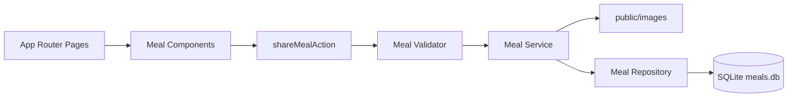

# 🍳 Quick Recipes – Fast Meals for Busy Days

Find and share quick, delicious recipes ready in 10 minutes or less. Browse by category, search by ingredients, save your favorites, and share your own recipes with the community.

**[Try it now →](https://recipe-hazel-zeta.vercel.app)**

---

## What You Can Do

✨ **Browse Recipes** — Explore a collection of quick meals across 6 categories: Breakfast, Lunch, Dinner, Desserts, Snacks, and Drinks.

🔍 **Search & Filter** — Find recipes by title, creator, category, or ingredients. Sort by newest first or alphabetically.

❤️ **Save Favorites** — Bookmark recipes you love. Your favorites are saved on your device and sync across tabs.

👨‍🍳 **Detailed Instructions** — View full recipes with ingredients, prep time, servings, difficulty level, and calorie count. Check off ingredients as you cook.

📤 **Share Recipes** — Submit your own quick recipes to the community with photos, ingredients, and step-by-step instructions.

🌙 **Dark Mode** — Toggle between light and dark themes for comfortable browsing any time of day.

---

## Deployment

This app is deployed live at **[recipe-hazel-zeta.vercel.app](https://recipe-hazel-zeta.vercel.app)**.

### Hosting on Vercel (Free)

The app works on Vercel's free tier:

- **Favorites** are saved in your browser, so they work without a backend database
- **Browsing** recipes works with the seeded database
- **New submissions** are accepted but not persisted (due to serverless filesystem limitations)

For a production app with persistent user submissions, consider upgrading to Supabase, Neon, Turso, or S3-compatible storage.

---

## For Developers

A full-stack Next.js App Router project built for fast, accessible recipe discovery. Uses SQLite, server actions, TypeScript, and SCSS.

[](https://nextjs.org/)
[](https://react.dev/)
[](https://www.typescriptlang.org/)
[](https://sqlite.org/)

### Quick Start (Local Setup)

Want to run the app locally? Here's how:

#### 1. Clone and install

```bash
git clone https://github.com/KeerthiYeruva/Recipe.git
cd Recipe
npm install
```

#### 2. Set up the database

```bash
node initdb.js
```

This creates a local SQLite database and seeds it with sample recipes.

#### 3. Start developing

```bash
npm run dev
```

Open [http://localhost:3000](http://localhost:3000) in your browser.

#### Available Commands

| Command              | What It Does                      |
| -------------------- | --------------------------------- |
| `npm run dev`        | Start local development server    |
| `npm run build`      | Create a production build         |
| `npm run start`      | Run the production build locally  |
| `npm run lint`       | Check code quality                |
| `npm test`           | Run tests                         |
| `npm run test:watch` | Run tests in watch mode           |

### Tech Stack

| Layer     | Technology                        |
| --------- | --------------------------------- |
| Framework | Next.js 16 App Router             |
| UI        | React 19                          |
| Language  | TypeScript 6                      |
| Styling   | SCSS and Sass modules             |
| Database  | SQLite with `better-sqlite3`      |
| Forms     | Server actions and `useFormState` |
| Utilities | `slugify`, `xss`, `sharp`         |

### Routes

| Route               | Purpose                                                                                  |
| ------------------- | ---------------------------------------------------------------------------------------- |
| `/`                 | Home page with slideshow, intro text, and calls to action.                               |
| `/meals`            | Searchable, filterable, sortable recipe grid.                                            |
| `/meals/[mealSlug]` | Recipe detail page with metadata, ingredients, instructions, tools, and related recipes. |
| `/meals/share`      | Recipe submission form.                                                                  |
| `/favorites`        | Browser-saved favorite recipes.                                                          |
| `/community`        | Community information page.                                                              |

### Project Structure

```text
src/
  app/                         App Router pages and route-level styles
    favorites/                 Favorites route
    meals/                     Meal list, detail, and share routes
    community/                 Community page
  features/
    meals/                     Meal actions, components, repository, service, types, utilities, validation
    theme/                     Theme provider, hook, toggle component, and types
  shared/                      Shared layout, media components, hooks, DB adapter, and common types
public/
  images/                      Seed and uploaded recipe images
initdb.js                      SQLite schema, migrations, and seed data script
```

### Data Flow



**Reading Recipes** — The `/meals` page loads all recipes from SQLite and passes them to the search/filter component. Users can search by name, creator, category, or ingredients. Sorting is done client-side with `useDeferredValue` for smooth UX.

**Sharing Recipes** — When a user submits via the form, the `shareMealAction` server action:
1. Validates all fields (text, email, image, prep time, servings, difficulty, calories)
2. Sanitizes instructions with `xss` to prevent injection
3. Saves the image to `public/images`
4. Inserts the meal into SQLite with a unique slug
5. Triggers ISR revalidation to refresh static pages

**Saving Favorites** — Favorites are stored only in the browser with `localStorage` using `useSyncExternalStore` for optimal re-render performance. No backend required.

### Environment Variables

| Variable             | Purpose                                                                           |
| -------------------- | --------------------------------------------------------------------------------- |
| `DATABASE_PATH`      | Path to SQLite database. Defaults to `meals.db` in project root.                  |
| `NEXT_PUBLIC_SITE_URL` | Base URL for sitemap/robots metadata. Defaults to `http://localhost:3000`.       |

Example:

```bash
DATABASE_PATH=./meals.db npm run dev
```
