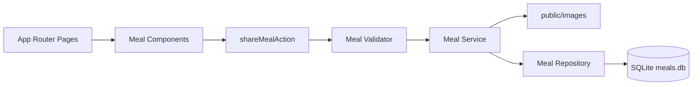

# Recipe App

A local-first recipe app built with Next.js. Users can browse quick meals, search recipes, filter by category, save favorites in the browser, open detailed cooking instructions, and share new recipes.

[](https://nextjs.org/)
[](https://react.dev/)
[](https://www.typescriptlang.org/)
[](https://sqlite.org/)

## Overview

Recipe App is a full-stack Next.js App Router project focused on a practical recipe browsing experience. It uses SQLite for local meal storage, server actions for recipe submissions, SCSS for styling, and feature-oriented folders for meals and theme logic.

The project is designed to work well as a portfolio or learning app on free hosting. Core browsing features are server-rendered, while browser-only features like favorites use `localStorage` so they do not require paid backend infrastructure.

## Features

| Area             | Details                                                                                    |
| ---------------- | ------------------------------------------------------------------------------------------ |
| Recipe browsing  | View seeded and submitted recipes from SQLite.                                             |
| Search           | Search recipes by title, creator, category, and ingredients.                               |
| Category filters | Filter meals by Breakfast, Lunch, Dinner, Dessert, Snacks, or Drinks.                      |
| Sorting          | Sort by newest, oldest, recipe name A-Z, or recipe name Z-A.                               |
| Recipe metadata  | Display category, prep time, servings, difficulty, and calories.                           |
| Favorites        | Save favorite recipes in the browser with `localStorage` and view them on `/favorites`.    |
| Ingredient tools | Check off ingredients while cooking and copy ingredients to the clipboard.                 |
| Related recipes  | Show related recipes on recipe detail pages.                                               |
| Recipe sharing   | Submit a recipe through a server action with validation and image upload.                  |
| Theme support    | Toggle between light and dark themes through React context.                                |
| Accessibility    | Includes semantic sections, labeled form controls, skip link support, and status messages. |

## Tech Stack

| Layer     | Technology                        |
| --------- | --------------------------------- |
| Framework | Next.js 16 App Router             |
| UI        | React 19                          |
| Language  | TypeScript 6                      |
| Styling   | SCSS and Sass modules             |
| Database  | SQLite with `better-sqlite3`      |
| Forms     | Server actions and `useFormState` |
| Utilities | `slugify`, `xss`, `sharp`         |

## Routes

| Route               | Purpose                                                                                  |
| ------------------- | ---------------------------------------------------------------------------------------- |
| `/`                 | Home page with slideshow, intro text, and calls to action.                               |
| `/meals`            | Searchable, filterable, sortable recipe grid.                                            |
| `/meals/[mealSlug]` | Recipe detail page with metadata, ingredients, instructions, tools, and related recipes. |
| `/meals/share`      | Recipe submission form.                                                                  |
| `/favorites`        | Browser-saved favorite recipes.                                                          |
| `/community`        | Community information page.                                                              |

## Project Structure

```text
src/
  app/                         App Router pages and route-level styles
    favorites/                 Favorites route
    meals/                     Meal list, detail, and share routes
    community/                 Community page
  features/
    meals/                     Meal actions, components, repository, service, types, utilities, validation
    theme/                     Theme provider, hook, toggle component, and types
  shared/                      Shared layout, media components, hooks, DB adapter, and common types
public/
  images/                      Seed and uploaded recipe images
initdb.js                      SQLite schema, migrations, and seed data script
```

## Data Flow



Meal reads are loaded from SQLite through the meal repository. The `/meals` page passes those meals into a client-side explorer component for search, category filtering, and sorting.

When a user shares a recipe, the form posts to `shareMealAction`. The action validates text fields, email, image, category, prep time, servings, difficulty, and calories. Valid instructions are sanitized with `xss`, the image is saved to `public/images`, and the meal is inserted into SQLite with a unique slug.

Favorites are different: they are saved only in the user's browser with `localStorage`. This keeps the feature free and simple, but favorites are device/browser-specific.

## Getting Started

### 1. Install dependencies

```bash
npm install
```

### 2. Create and seed the database

```bash
node initdb.js
```

This creates `meals.db` and inserts the sample recipes. The app also includes lightweight SQLite column migrations for the recipe metadata fields.

### 3. Start the development server

```bash
npm run dev
```

Open http://localhost:3000.

## Commands

| Command            | Description                                    |
| ------------------ | ---------------------------------------------- |
| `npm run dev`      | Start the local development server.            |
| `npm run build`    | Create a production build.                     |
| `npm run start`    | Run the production build.                      |
| `npx tsc --noEmit` | Type-check the project without writing output. |

## Environment Variables

| Variable        | Purpose                                                                              |
| --------------- | ------------------------------------------------------------------------------------ |
| `DATABASE_PATH` | Optional path to a SQLite database file. Defaults to `meals.db` in the project root. |

Example:

```bash
DATABASE_PATH=./meals.db npm run dev
```

## Deployment Notes

This app can be hosted on Vercel's free plan for portfolio/demo use.

Important production limitations:

- SQLite is local file storage. It is convenient for local development, but not ideal for durable production writes on serverless hosting.
- Uploaded images are written to `public/images`. On serverless platforms, this is not reliable permanent storage for user uploads.
- Favorites are stored in `localStorage`, so they are saved per browser and do not require a server.

For a production app with real user submissions, move the database and images to free hosted services such as Supabase, Neon, Turso, Cloudinary, Vercel Blob, or S3-compatible storage.

## Current Status

- TypeScript validation passes with `npx tsc --noEmit`.
- The app has free-friendly recipe discovery, favorites, ingredient tools, and metadata features.
- Local SQLite/native build issues can depend on the machine's Node and native package setup. Reinstall dependencies or rebuild `better-sqlite3` if needed on a new device.
